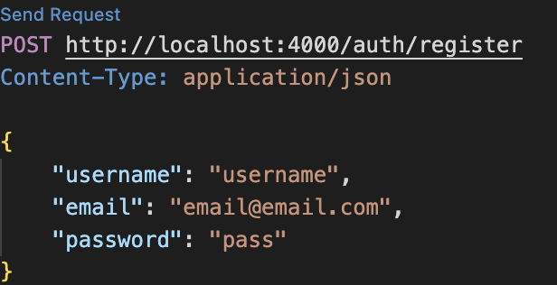

# Nodejs & MongoDB - Template

## Backend

### TL;DR:

1. Clone this git repository:
2. Change into the backend directory
3. Open the ```.env``` file in the replace the string in the variable with your credentials ```MONGODB_URL="mongodb+srv://<username>:<password>@<cluster>.mongodb.net/<database>"```
4. Run ```npm install``` to install all nodejs packages
5. Run ```node app.js``` to start the server


### Intro: 

This template contains the basic file structure and an example to connect MongoDB to your NodeJS server. Feel free to modify it as you see fit. 


### File structure explained:

```app.js``` is the main server file located at the root of the ```backend``` directory.
Everything related to MongoDB is stored in these 3 folders: ```config```, ```models```, and ```routes```  
The ```/config/dbConfig.js``` file contains the URL and options to connect to MongoDB.
 - It is considered a good practice to have your connection string located in a ```.env``` file. As such, please add your own MongoDB url by editing the ```MONGODB_URL``` variable inside the ```.env``` file. 
 - Once we specify the ULR and options the mongoose.connect function will connect to our MongoDB and export that connection. using the ```module.exports = mongoose.connection;```. We import the file ```dbConfig.js``` in our ```app.js``` file and once we run the ```app.js``` file the connection to MongoDB will be established (no additional functions are necessary). 

 The ```/models/user.js``` file contains the user schema that will be used by MongoDB.
  - Once we specify the attributes of our schema we export it using ```module.exports = User;```

  The ```/routes/addUser.js``` file contains the route to add a new user to MongoDB.
   - We import the ```User``` schema we created earlier using ```const User = require('../models/user');```
   - We also import the express router using ```const router = express.Router();``` so that we could use could export the route component. (Alternatively, we could avoid using the express router and have the HTTP Post method directly in our ```app.js``` file. Using the express router is a good practice to organize our routes).
   
   ```JAVASCRIPT
   router.post('/register', async (req, res) => {
        try {
            const { username, email, password } = req.body;

            // Create a new user
            const newUser = new User({ username, email, password });

            // Save the user to the database
            await newUser.save();

            res.status(201).json({ message: 'User registered successfully' });
        } catch (error) {
            res.status(500).json({ error: error});
        }
    });
   ```
- Inside the ```router.post()``` function we have a try-catch block that gets the username, email, and password from the request body. Then using these values we create a creates a new instance of a User model ```new User({ username, email, password });```. The User schema was imported from the ```user.js``` file. 
- Using the ```await newUser.save()``` function we save the newly created user to MongoBD. 
- If the user was created successfully, we will get a success message, otherwise, the catch block will return the error. 
- Finally, this HTTP POST route is exported using ```module.exports = router;```

In the ```app.js``` file we import the addUser file and using the ```app.use()``` middleware we add the ```/register``` path to the ```/auth``` base path. 

- Assuming that we use port 4000, to register a user, we would need to send a request body to this url: ```http://localhost:4000/auth/register```


### How to(s):
 - How to add your MongoDB URL: 
    - Inside the ```.env``` file, replace the ```<username>```, ```<password>```, ```<cluster>```, and ```<database>``` with your actual MongoDB credentials and database name.
 - Create your schema(s) by create a file inside the models directory and exporting it using ```module.exports = <schema-name>``` 
 - Add route(s) inside the ```routes``` directory and export the router using ```module.exports = router;```
 - Don't forget to import the routes in the ```app.js``` file and access them using the ```app.use('/', nameOfRoute)``` middleware.


 ### Extra:
  - If your using ```VSCode``` you can quickly test your HTTP requests using this extension: ```humao.rest-client```
    - Once you install this extension, create a file inside your project directory ```routes.rest``` 
    - Here is how I configured the file to register a user to MongoDB in this NodeJS-MongoDB-Template:
    ```JSON
    POST http://localhost:4000/auth/register
    Content-Type: application/json

    {
        "username": "username",
        "email": "email@email.com",
        "password": "pass"
    }
    ```
    - The first line specifies the type of HTTP request followed by the URL
    - The second line specified that the content type will be of type json
    - Then we send a JSON string
    - To run the request press the ```Send Request``` button
    